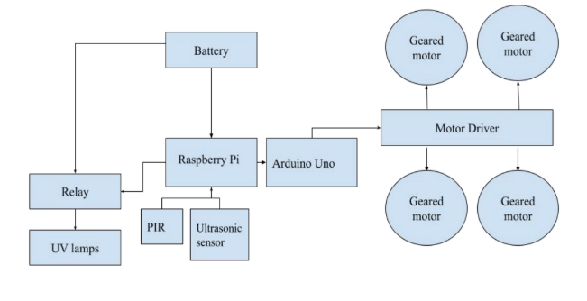
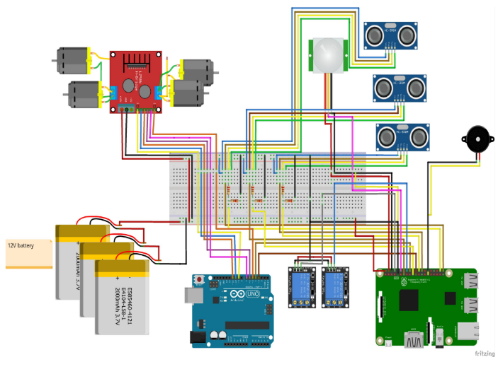
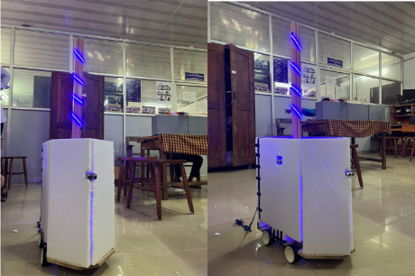

**UV DISINFECTION ROBOT USING RASPBERRY PI**

UV Disinfection robot can be used in rooms and other indoor areas. The robot will move around every space of the room, leading to the disinfection of the whole space. The UV Disinfection robot works under the aid of the raspberry pi micro controller.The robot uses Raspberry pi Model B with a 4 GB RAM.

**MODEL**

The system has two types of sensors:

(1) Passive Infrared sensor - It is used for human detection. It measures the infrared rays constantly and produces an alarm whenever it is detected. Since humans possess a particular temperature, infrared rays are constantly radiated. Whenever a human presence is detected in the vicinity, the robot stops its action and turns off the UV lamp. Thereby the safety is ensured.

(2) Ultrasonic sensor - In a room, there could be a lot of objects that could possibly affect the smooth movement of the robot. The ultrasonic sensor senses the collision and makes the robot move away from the object. It uses sound waves of very high frequency to locate and track objects that are in their range. Hence the collision is avoided.

The movement of the robot is facilitated by DC geared motor. It is connected to the L298N motor driver which controls the motors from the signals received from the raspberry pi micro controller. UV lamps are used for the disinfection process. The relay controls the UV lamp as and when it is required to turn ON and OFF. A rechargeable battery is used for powering the whole system.

**CIRCUIT DIAGRAM**

**HARDWARE SETUP**

